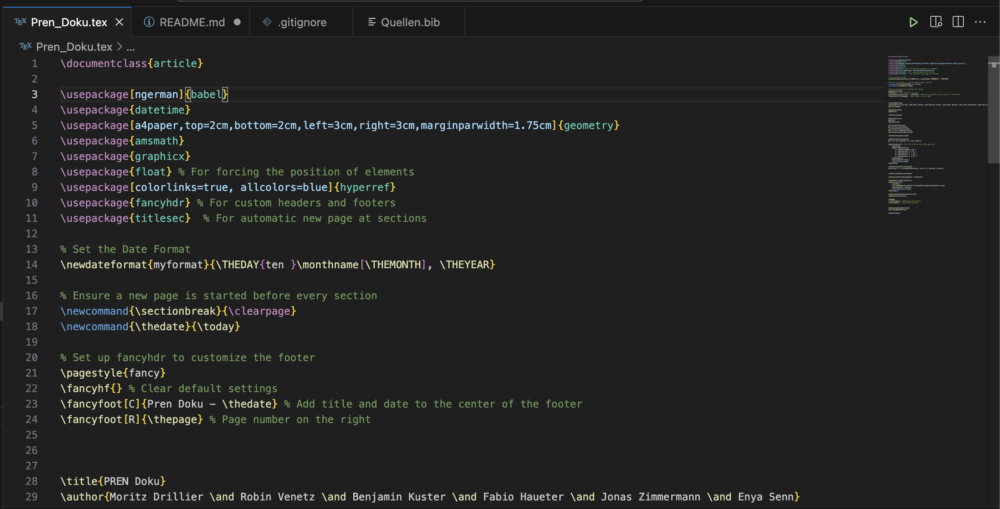
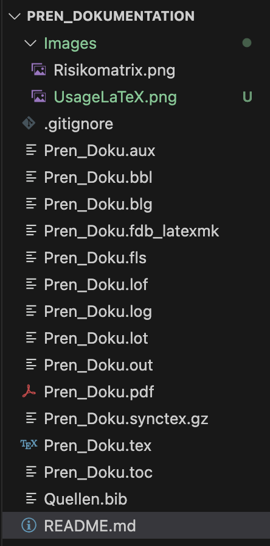

# Pren_Dokumentation

This repository contains the documentation files for the **PREN** project, written in LaTeX. Follow the steps below to set up LaTeX in Visual Studio Code and compile the documents.

## Prerequisites

Before you begin, ensure you have the following installed on your system:
- **TeX Live**: The LaTeX distribution that provides the necessary tools and packages for compiling `.tex` files.
- **Visual Studio Code**: A code editor with extensions for LaTeX support.
- **LaTeX Workshop**: A Visual Studio Code extension that simplifies LaTeX document compilation and preview.

---

## Installation Guide

### Step 1: Install TeX Live

TeX Live is a distribution that includes all the essential LaTeX tools and packages. You can download and install it by visiting the official website:

- [TeX Live Installation](https://www.tug.org/texlive/)

Follow the instructions on the TeX Live website to install the distribution on your operating system.

### Step 2: Configure PATH Environment Variable

Once TeX Live is installed, you need to configure your system's PATH environment variable so that LaTeX tools (like `pdflatex`, `latexmk`) are available in the terminal.

Refer to the [TeX Live Quick Install Guide](https://www.tug.org/texlive/quickinstall.html) for instructions on how to set the PATH for your specific operating system.

For example, on macOS, you can add the following line to your `.bash_profile` or `.zshrc` file:

```bash
export PATH="/Library/TeX/texbin:$PATH"
```

Make sure to reload the terminal or use `source ~/.zshrc` (or equivalent) to apply the changes.

### Step 3: Install LaTeX Workshop Plugin in Visual Studio Code

LaTeX Workshop is a Visual Studio Code extension that simplifies the LaTeX compilation process, provides IntelliSense, and offers a live preview feature.

1. Open Visual Studio Code.
2. Install the LaTeX Workshop extension from the Visual Studio Marketplace by visiting this [link](https://marketplace.visualstudio.com/items?itemName=James-Yu.latex-workshop), or by running the following command in the VS Code command palette (`Ctrl+P` or `Cmd+P`):
   ```bash
   ext install latex-workshop
   ```

This plugin will allow you to compile `.tex` files directly within Visual Studio Code using a convenient GUI.

---

## Usage

### Step 1: Open the LaTeX Document

Once you have everything installed, navigate to the root of your project and open the main LaTeX document, `Pren_Doku.tex`, in Visual Studio Code.

### Step 2: Compile the LaTeX Document

To compile the LaTeX document and generate a PDF:

- **Option 1**: Click on the **green start button** in the Visual Studio Code toolbar (usually at the top right when a `.tex` file is open).
- **Option 2**: Save the file (`Ctrl + S` or `Cmd + S`) to trigger the LaTeX Workshop plugin to compile automatically.

Here is what the interface looks like:



### Step 3: View Compiled Files

After compiling, the output files (such as the PDF, auxiliary files, etc.) can be viewed in the **Document Tree** in the VS Code file explorer:



You can click on the compiled `.pdf` file to preview the document directly within Visual Studio Code.

---

## Additional Notes

- The LaTeX Workshop extension provides live updates to the PDF as you edit your `.tex` files, making it easier to preview changes in real-time.
- If you encounter any errors during compilation, check the **Problems** tab in Visual Studio Code for debugging information.
- Ensure that all required packages and images are available in the project directory to avoid compilation errors.

